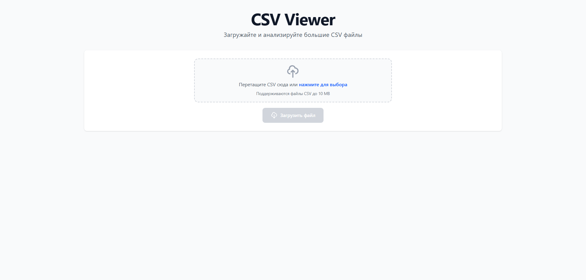
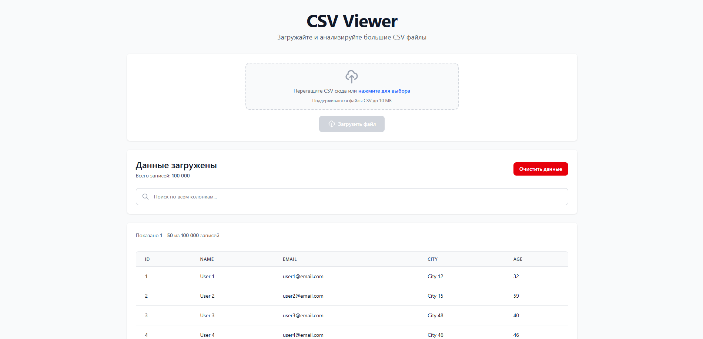

# CSV Viewer Application

Веб-приложение для загрузки, просмотра и поиска по большим CSV файлам (10^5 - 10^6 строк).

### Главная страница



## Стек технологий

### Backend

- **Go 1.23** - серверная часть
- **Chi Router** - HTTP роутинг и middleware
- **In-memory storage** - хранение данных в памяти

### Frontend

- **React 19** - UI библиотека
- **Vite** - сборщик и dev-сервер
- **Tailwind CSS v4** - стилизация

### Infrastructure

- **Docker** & **Docker Compose** - контейнеризация
- **GitHub Actions** - CI/CD

## Возможности

✅ Загрузка CSV файлов до 10MB  
✅ Просмотр данных с пагинацией (50 записей на страницу)  
✅ Полнотекстовый поиск по всем колонкам  
✅ Адаптивный интерфейс  
✅ Обработка больших файлов (10^5+ строк)

### Таблица данных



## Быстрый старт

### Предварительные требования

- Docker 20.10+
- Docker Compose 2.0+

### Запуск приложения

```bash
make up
# или
docker-compose up --build
```

Приложение будет доступно по адресу: **http://localhost:3000**

API доступен по адресу: **http://localhost:8080**

### Остановка приложения

```bash
make down
# или
docker-compose down
```

### Запуск (без Docker)

#### Backend

```bash
# Запустить сервер
go run cmd/server/main.go
```

Сервер запустится на порту `:8080`

#### Frontend

```bash
# Запустить dev-сервер
npm run dev
```

Frontend будет доступен на `http://localhost:3000`

## Тестирование

```bash
make test
# или
go test ./... -v -cover
```

### Генерация тестовых данных

Для тестирования с большими CSV файлами:

```bash
make generate-csv
# или
go run ./utils/generate_csv.go
```

Будет создан файл `test_data_100000.csv` со 100 000 строками.

## API Endpoints

### POST /api/upload

Загрузка CSV файла

**Request:**

- Content-Type: `multipart/form-data`
- Body: файл с ключом `file`

**Response:**

```json
{
  "message": "File uploaded successfully",
  "row_count": 100000,
  "headers": ["ID", "Name", "Email", "City", "Age"],
  "sample_data": [
    {"ID": "1", "Name": "User 1", "Email": "user1@email.com", ...}
  ]
}
```

### GET /api/data

Получение данных с пагинацией

**Query параметры:**

- `page` (int) - номер страницы (по умолчанию: 1)
- `per_page` (int) - количество записей на страницу (по умолчанию: 50)

**Response:**

```json
{
  "data": [...],
  "total": 100000,
  "page": 1,
  "per_page": 50,
  "headers": ["ID", "Name", "Email", "City", "Age"]
}
```

### GET /api/search

Поиск по данным

**Query параметры:**

- `q` (string) - поисковый запрос
- `page` (int) - номер страницы
- `per_page` (int) - количество записей на страницу

**Response:** аналогичен `/api/data`

### DELETE /api/clear

Очистка загруженных данных

**Response:**

```json
{
  "message": "Data cleared successfully"
}
```

## Архитектура проекта

```
CSVviewer-app/
├── cmd/
│   └── server/
│       └── main.go           # Точка входа приложения
├── internal/
│   ├── handlers/             # HTTP обработчики
│   │   ├── handlers.go
│   │   └── handlers_test.go
│   ├── models/               # Модели данных
│   │   └── models.go
│   └── storage/              # Слой хранения данных
│       ├── storage.go
│       └── storage_test.go
├── utils/
│   └── generate_csv.go       # Утилита генерации CSV
├── web/                      # Frontend приложение
│   ├── src/
│   │   ├── components/       # React компоненты
│   │   │   ├── DataTable.jsx
│   │   │   ├── FileUpload.jsx
│   │   │   └── SearchBar.jsx
│   │   ├── App.jsx
│   │   └── main.jsx
│   ├── Dockerfile
│   └── vite.config.js
├── docker-compose.yml
├── Dockerfile
├── Makefile
└── README.md
```

## Ограничения и особенности

- **Размер файла**: максимум 10MB
- **Формат**: только CSV файлы
- **Хранение**: данные хранятся в памяти
- **Поиск**: case-insensitive поиск по всем полям
- **Производительность**: оптимизирован для 100k+ строк
